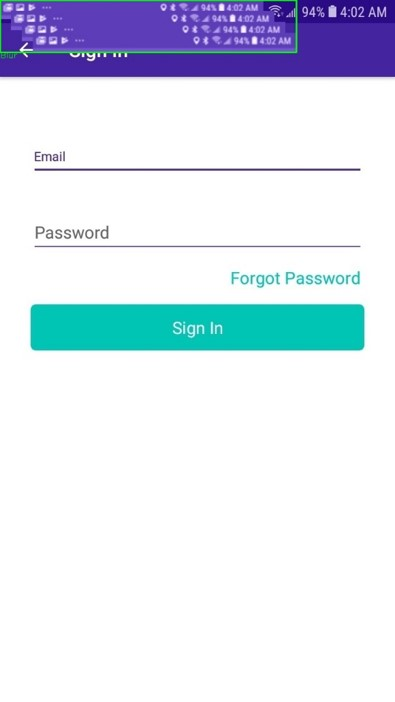

# DSL defined UI-bug Dataset automatic generation 

This is a tool which can generate the UI-bug Dataset according to the UI-bug style defined by user's DSL.

Here is an easy example, if we want a coco style dataset of text overlap, we can define our DSL as follow, which means our target bug category is "text overlap" and for random text widget in normal:

text overlap:Text keep full nochange [X1+20,Y1+20,X2+20,Y2+20]

then we can get auto generated pictures like below, as you can see, we randomly chosed a text widget and make it shift to the right bottom by 20 pixels. See the "Happening Nearby":

Here is the grammer of our DSL:

    Bug-> BugType:Widget Keep Trans
    BugType = str
    Widget = {widget, text, image, tool bar...20+ categories}
    Keep = {keep, nokeep} # if we keep the origin widget on the screenshot
    Trans -> Trans|Trans Tran #Tran is the rule that how widgets transform
    Tran -> Focus Func Bounds
    Focus -> focus/nofocus # the widget that we deal with is a rectangle area of just foreground of the widget area
    func = {cut, null, nochange, high_saturation,snow,distortion,oclusion}
    Bounds->[X1 expr,Y1expr,X2 expr,Y2 expr]
    expr = coordinate operation with x and Y

So each Bug is defined as its category name "BugType", the kind of widget it operates "Widget", whether to "keep" the original widget, and "Trans" rules. For each "tran", we get the full area widget image or "focus" foreground widget image, use "Func" to tran the widget image, the put the operated image to coordinate Bounds.
Here we assume the origin coordinate is [X1, Y1, X2, Y2], so the "Bounds" part has defined the expansion and displacement of widgets.
To explain "Focus":

So the example of text overlap can be parsed as the following syntax tree:

Or for occulation, you can write a dsl scentence like this:
Blur:UpperTaskBar keep 
full distortion [X1,Y1,X2*2/3+X1/3,Y2*2/3+Y1/3]|
full distortion [X1+20,Y1+20,X2*2/3+X1/3+20,Y2*2/3+Y1/3+20]|
full distortion [X1+40,Y1+40,X2*2/3+X1/3+40,Y2*2/3+Y1/3+40]|
full distortion [X1+60,Y1+60,X2*2/3+X1/3+60,Y2*2/3+Y1/3+60]
Which we get:

## How to use
1. prepare a coco-style normal UI dataset
2. Set the parameters in config.json 
{
    "dataset_style": "coco", # just set coco
    "gennum": 300, # the number of each kind of UIbug
    "UI_dir": "path to the normal UI images",
    "annotation_dir":"path to the parent dir of annotation_file",
    "annotation_file": "path to the annotation json file",
    "version_name": "used to append on the UI-bug image name"
}
3. run main.py